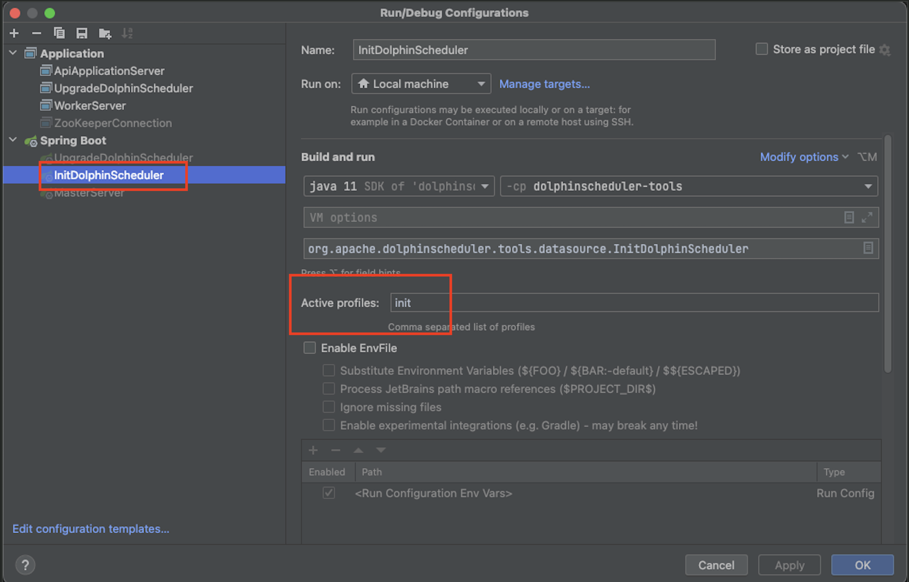

## Prepare on localhost
###I. API-Server setup
1. Check out to `develop` branch
2. Run `zookeeper` and `posgresql` via manualy setup or with this `docker-compose file`
  - `quantum-composer/docker-compose.yml`
3. Config profile `init` for class: `dolphinscheduler-tools/src/main/java/org/apache/dolphinscheduler/tools/datasource
   /InitDolphinScheduler.java` to init data for postgresql (see picture below)
   
4. Regist `MasterServer`, `WorkerServer`  to zookeeper by Run 2 below classes:
   - `dolphinscheduler-master/src/main/java/org/apache/dolphinscheduler/server/master/MasterServer.java`
   - `dolphinscheduler-worker/src/main/java/org/apache/dolphinscheduler/server/worker/WorkerServer.java`

5. Run `ApiApplicationServer` at path `org.apache.dolphinscheduler.api.ApiApplicationServer` to start API-Server
###II. Frontend setup
Plese refer to `dolphinscheduler-ui/README.md`
